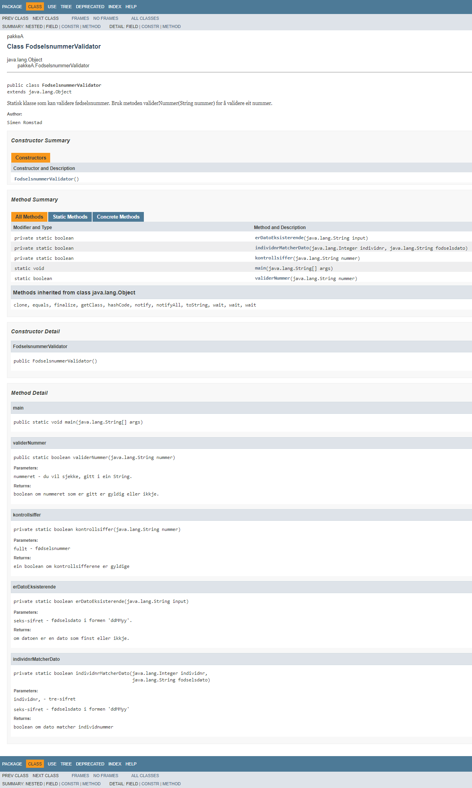

# Fødselsnummervalidator
Ein løysing på ein heimeoppgåve eg fekk frå NAV IT i Oslo angående sommerjobb.

### Prosjektet inneholder:
* Ein fødselsnummer-validator: /NAV_kodeoppgave/src/pakkeA/FodselsnummerValidator.java
* Ein JUnit-tester som tester for ekte og falske nummer: /NAV_kodeoppgave/src/tester/Tester.java
* JavaDoc som forklarer klassen og metodene i prosjektet.

### Fullstendig JavaDoc finner du under /doc 

